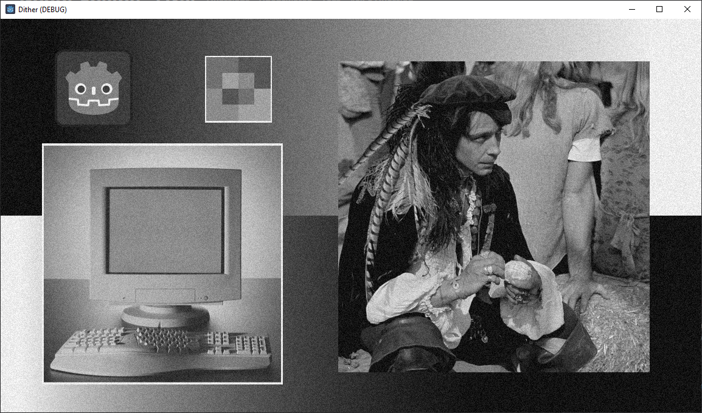

# Quantization and Dithering

This is a work-in-progress Godot 4 project implementing greyscale quantization and dithering as a post-processing shader. The implementation builds on the paper [Optimal Dither and Noise Shaping in Image Processing](https://uwspace.uwaterloo.ca/handle/10012/3867?show=full) by Cameron Christou. Other resources used include:

* [Hash Functions for GPU Rendering](https://www.jcgt.org/published/0009/03/02/) by Mark Jarzynski and Marc Olano
* [The USC-SIPI Image Database](https://sipi.usc.edu/database/)

## Documentation

The post-processing shader has several configuration options exposed as uniforms. These are configurable in Godot's inspector under the material properties for the Dither ColorRect. The settings are:

* Enable: Unchecking this turns off greyscale conversion, quantization, dithering, etc.
* Use Time: Normally the dithering noise is strictly determined from the screen UV coordinates, making the noise static. Checking this adds the game time to the hash input, effectively resampling the noise each frame.
* Hard Clipping: The method described in the paper assumes the input signal is sufficiently limited that the quantizer won't produce out-of-range values. Two dumb methods are implemented:
  * Compression (unchecked): Input values are scaled to a safe range. This is not content-aware, so safe inputs will have their contrast unnecessarily reduced.
  * Clipping (checked): Input values are clipped to a safe range. Contrast is retained, but shadow and highlight details are lost.
* Show Unquantized: Skip quantization and subsequent steps, showing the output of clipping/compression.
* Show Error: Replace the image with the total quantization error.
* Perceptual Error: The total quantization error is added to a mid grey and replaces the image. This is done in one of two ways:
  * Unchecked (Y-space): The paper renders the error by adding it to 50% luminosity grey. Due to the nonlinearity of the human eye, this underemphasizes error in dark portions of the image and overemphasizes error in light portions of the image.
  * Checked (L*-space): The error is computed as the difference in perceptual lightness and added to 50% perceived lightness grey (i.e. "18% grey").
* Midriser: Selects between the two quantizer formulas described by the paper. When unchecked, the midtread quantizer is used instead.
* Dither: Unchecking this turns off dithering but leaves greyscale conversion and quantization enabled.
* Subtractive: Controls whether the dither noise is subtracted from the quantizer output.
* Noise Order: Selects between RPDF noise (1), TPDF noise (2), or the next higher order (3). The last setting is just there because pcg3d gives an extra noise sample for free.

The default settings, following the paper's terminology, are to quantize to three bits using a subtractive dither scheme and RPDF dither (see Figure 2.7 from the paper). The default schene includes a Y-space gradient, an L*-space gradient, Figure 2.4 from the paper (the greyscale image of a computer monitor and keyboard), Figure 2.13 from the paper (the third-moment test image), test image "Male" from the "misc" collection in the USC-SIPI database, and the Godot logo.

## TODO

* Perceptually uniform quantization
* More intelligent clipping
* Proper 3D color quantization
* Dither feedback
